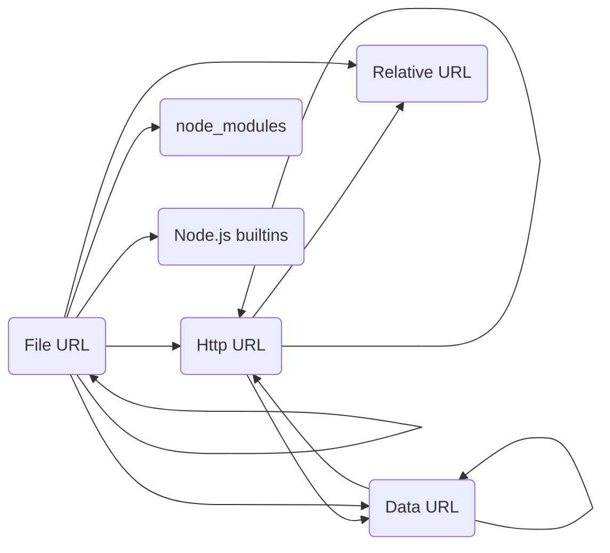

# Module Loader

This module loader allows loading ESM modules from HTTP and data: URLs.

A brief chart of what is allowed to import what:



- `file:` modules can import:
    - other `file:` modules
    - `http:` modules
    - `data:` modules
    - `node_modules` modules
    - Node.js builtins
    - relative URLs (e.g. `./foo.js`)

- `http:` modules can import:
    - other `http:` modules
    - `data:` modules
    - relative URLs (e.g. `./foo.js`)

- `data:` modules can import:
    - other `data:` modules
    - `http:` modules

## Usage

Via Node.js CLI:

```
node --import @nodescript/module-loader/register ./entrypoint.js
```

Or in `mocharc.json`:

```json
{
    "require": [
        "@nodescript/module-loader/register"
    ]
}
```
